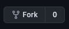

# Welcome!
## Introduction
You've found AirReps's official guides/documentation website!

We strive to keep our docs open, and easily understandable.Therefore, if you think we should change something, please **fork this repository**, make a change/edit/new document, and raise a pull request!

## I'm new to Git, how can I contribute?
> [Github has a fantastic tutorial, which walks you through the core processes of git](https://guides.github.com/activities/hello-world/). These are:
> * Creating a repository (not necessary for your needs)
> * Creating a branch (not necessary for your needs)
> * Making a commit 
> * Opening a Pull Request
> * Merging a Pull Request (not necessary for your needs)

### That may seem overwhelming, but this is all you need to do:
1. First, make sure you have a GitHub account.
1. Fork this repository by pressing the **Fork** button in the top right hand corner
    * 
1. Open up your forked repository and edit where needed.
1. When ready, Open a Pull Request to [**merge your local changes, into our repository**](https://guides.github.com/activities/hello-world/#pr).
1. Our team will be notified that a new PR has been raised.If everything looks good, we'll merge it in 🎉🎉

# Adding New Pages
New pages can be added, so long as they follow our naming and header conventions.

## Document naming convention
```shell
{{category}}-{{topic}}.md

Example:
guide-troubleshooting.md
```

### Document header convention
> All documents require this header!
```shell
---
id: {{category}}-{{topic}}
title: {{human-readable-titel}}
custom_edit_url: https://github.com/AirReps/website-content/blob/edit/{{document-name}}.md
---

Example:
---
id: guide-troubleshooting
title: Troubleshooting
custom_edit_url: https://github.com/AirReps/website-content/blob/edit/guide-troubleshooting.md
---
```

### Linking newly added pages (dev team only)
> Only members of our teamn can link new pages to our website logic.

Add the document's header `id` to [sideBars.js](https://github.com/AirReps/airreps-site/blob/development/sidebars.js) in our `airreps-site` repository. Merge when ready.


# Build & Deploy (dev team only)
> Build and deployments are handled automatically by our pipeline. This happens when a PR is completed on `website-content`'s master branch.
>
> However, you can trigger a build/deployment cycle manually if desired.

### Run a manual build/deployment 
You can run a build/deployment cycle with Github Actions in this repository.
1. [Navigate to the "Actions" tab](https://github.com/AirReps/website-content/actions?query=workflow%3A%22Publish+Documentation%22)
1. Click `Run Workflow`
    * Make sure `Use workflow from: "Branch: master"` is selected.
1. Click the green `Run Workflow` button.