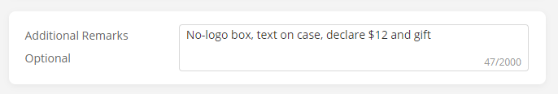

## Buying from AliExpress/Alibaba
:::info
By letting the sellers know that you’re from the AirReps community, 
they’re pressured to give you better service because of our standards. 
It also gives us better leverage for future buyers like you. For both you 
and us, please let them know that you’re from our AirReps community!
:::

* You can buy from Ali the same way as buying anything else online. 
  It's safe and your card details are encrypted through AliPay. 
  Just don't expect free returns, full refunds, or great customer service like Amazon.
  Even if the product is faulty, there is no 100% guarantee that you will receive a full refund.
  *BUY AT YOUR OWN RISK*
* Always try to pay with a credit card or debit card that allows chargeback. 
  This will be helpful if the seller doesn't agree to a refund.
* In the order details box put "No logo box, with text on the case, declare Gift 
  and Value: $11 please" when ordering. 
  * OR If you want the box with Apple logos, you can put "with Apple box" instead of 
    "no logo box". BUT there is a higher chance of it being seized at customs, and you 
    possibly won't get a refund. Personally, we don't recommend it since it's just 
    the logo on the box, the AirPods inside are exactly the same, but if you really 
    want it you can take the risk.
* After you buy, go to your order page and see what the name of your product is 
  (e.g. Pro Airoha white). Click Contact Supplier to message the seller and confirm 
  they're sending that one. Don't ask them things like "is this v2.5 with an 
  Airoha chip?", they don't use these names. You can also ask about the "No logo box, 
  with text on the case, declare Gift and Value: $11" to see if it's possible. 
  NOTE: Some sellers may tell you they aren't able to do this.
* In your Order page on Ali, there will be a shipping countdown that will auto-confirm 
  delivery after a number of days. If the timer has 1 day left and you still haven't 
  received them, make sure you click "Extend Shipping Time" to extend it 15 more days. 
  Only click "Order Received" once you have them and have checked they work properly.

* If you order from HiCity, you might want to consider buying through his official 
  website [https://hicity.airreps.info/](https://hicity.airreps.info/) instead as 
  he cannot sell with apple markings on the airpods themselves on AliExpress. 
  Note: There will be no corporation-backed buyer guarantee, but HiCity has shown 
  us in the past that he’s trustworthy.
  

## Ordering Links
:::info
List is in order from newest to oldest
:::

:::tip
We recommend you add the following remarks in your purchase comments.

:::

### AirPods 2
#### v3m (Latest)
HICITY (no Apple text) https://airreps.link/hcv3md  [open on desktop]
* If you want Apple Text you need to purchase the reps
  through HiCity’s official website:
  [https://hicity.airreps.info](https://hicity.airreps.info)

You may also contact HiCity on his
WhatsApp: +86 137 1229 5625* (you will need to wait until he goes
online to get a quick response), and he usually wants
you to pay through [TransferWise](https://airreps.link/transferwise)

#### v3
VINCENT: [https://airreps.link/vv25](https://airreps.link/vv25) | Choose "Airoha Stable Version"

#### v2 (Value)
*Currently no sellers*

#### v1.5 (Budget)
VINCENT: [https://airreps.link/vv25](https://airreps.link/vv25) | Choose "Jerry Version"

## AirPods Pro
#### v4.5 (Latest)
VINCENT: [https://airreps.link/vv45](https://airreps.link/vv45) | Choose "V4.5"

HICITY (no Apple text): [https://airreps.link/hcv45d](https://airreps.link/hcv45d) [open on desktop]
* If you want Apple Text you need to purchase the reps
  through HiCity’s official website:
  [https://hicity.airreps.info](https://hicity.airreps.info)

#### v4
HICITY (no Apple text): [https://airreps.link/hcv4blued](https://airreps.link/hcv4blued)
* If you want Apple Text you need to purchase the reps
  through HiCity’s official website:
  [https://hicity.airreps.info](https://hicity.airreps.info)
