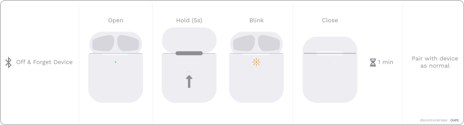

:::tip
Found a new issue and/or fix?

[Please fork this document, edit it, and create a PR!](https://github.com/AirReps/website-content/blob/edit/guide-troubleshooting.md)
:::

## Common Issues

### macOS incompatibility
This issue is caused by iCloud verification failing, as the replicas do not support iCloud fully. 
The issue can be fixed by first forgetting the airpods on any iCloud device (iOS, iPadOS, WatchOS etc) you have connected to before.
 
### Audio/video frequently pauses
This is very common on cheaper replicas, it is caused by the in ear detection sensors. 
This can also happen when the pods don't fit your ear fully. 
The fix is to either choose other eartips (on pros) or turn off in ear detection through settings.
 
### AirPods stay connected after closing case  
This is an issue that is caused by the magnets inside the case, and the hall-effect sensor that checks in which position the magnetic field is.
To fix this issue you will need to follow the steps in [this youtube tutorial](https://youtu.be/kv5Ixw_YY2E)

### Poor sound quality / Bass issues in iOS  
This issue is caused by **Headphone Accomodation** being on by default. 
You will need to turn this feature off by going to 
```
Settings -> Accessibility -> Audio / Visual -> Headphone Accomodations
```

### Pairing reset   
This reset will help if only one pod is working, and it starts slowly flashing every time you open the case.
* Hold the back pairing button for 2-3 seconds while the pods are in the case.

### Soft reset


1. Forget your device from Bluetooth settings, then turn off Bluetooth.
1. Open the lid and hold the back button for a few seconds, until the light flashes, then close the lid. 
   Don't worry if your light doesn't flash the same as in the image.
1. Wait a full minute, then turn on Bluetooth, open the lid and try to reconnect
1. If it doesn't work, take the pods out and put them back in. Close the lid and wait for the light to turn off. 
   Then open it and try again. It can take 3-4 SOFT RESETS to work. If it doesn't try a HARD RESET


### Hard reset
1. Forget your device from Bluetooth settings
1. Leave the pods outside of the case for several hours to let the battery fully drain. 
   Leave the case open. It's important to not have any residual charge left, so leave it out one full day or more
1. Once it's drained, put the pods back in the case and charge the case for a while
1. Then, do a SOFT RESET. It can take 3-4 SOFT RESETS to work


### L/R imbalance (easy fix)
#### iOS
Head to: 
```
Settings -> Accessibility
```

#### Android
1. In the Settings app, select Accessibility from the list.
1. On the Accessibility screen, scroll down to the Audio and On-Screen Text section. 
   Here, you can adjust the left/right volume balance.
1. Move the slider until the audio seems to be calibrated right.

### L/R imbalance (advanced fix)
:::caution
This fix requires dissasembly and soldering skills
:::
This fix usually works better for stable bass and audio.  
If one of your AirPods is quieter or louder than the other you can try 
[this community-written guide:](https://airreps.info/outofphase).

Being "quieter" is not the correct description actually, they are out of phase. 
This happens when the people assembling the earbuds miswire one of them, resulting in an unpleasant 
sound and apparent lack of bass from one side. You can test your pair for phase alignment using this test.

### Cannot connect to macOS
1. Forget the AirPods from your iPhone (Seems to be an issue with iCloud Connect).
1. Try to connect it now with your Mac.
1. (Optional) If you hear no sound playing from them when they’re connected, try to reset your headset.

## Audio doesn't play while Apple Watch is connected "WatchOS 7+ Issue"

:::info
This issue has been fixed on the latest firmware/version of clones (January 2021). 

Update your firmware if you're experiencing this issue.
:::

If you're running WatchOS you might experience issues with your AirPods clones like them not connecting or freezing 
up your phone, this can be fixed in two ways.  
> Credits to SykadeLick#4034 on discord for tracking down the issue.
> 
#### Works for all clone types  
1. Power off your Apple Watch/Put it in airplane mode  
1. Your AirPods should now function correctly.

#### Only works for AirPods Pro clones
1. With your AirPods Pro in your ears, go to Settings > Bluetooth on your iOS device.   
1. Tap the info button next to your AirPods in the list of devices.  
1. Tap Ear Tip Fit Test.  
1. Tap Continue, then tap the Play button.  
1. Your AirPods Pro should now function correctly.


## None of the above fixed my issue
Your AirPods probably arrived faulty, or they are broken beyond repair. 
You can keep trying [soft resets](#soft-reset) and different [hard resets](#hard-reset). 
* e.g.
  * Leaving it out 1+ days,
  * or not keeping the case open,
  * or playing music instead of forgetting the device, 
  * or whatever other things that may drain the battery.

*If nothing at all works*, contact your seller and ask for a refund or replacement. 
If they don't agree, start a refund directly through Ali, that mostly works but if that doesn't work out consider doing a chargeback on your card.