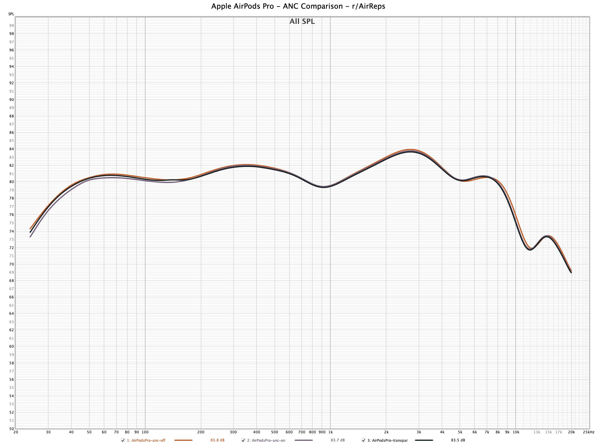

:::info
To see a larger version of our graphs, right click the image and select "Open image in new tab"
:::

## Benchmark
The following readings are what other headsets are benchmarked against.

## EarPods (wired)
-coming soon

## AirPods 1
-coming soon

## AirPods 2

[Source](https://www.rtings.com/headphones/1-4/graph#797/3992)

## AirPods 3 (coming soon?)
-coming soon?

## AirPods Pro
- Orange line: ANC OFF
- Purple line: ANC ON
- Grey/Black line: Transparency Mode

