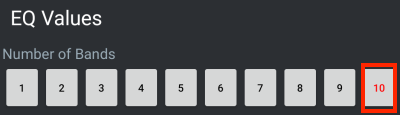
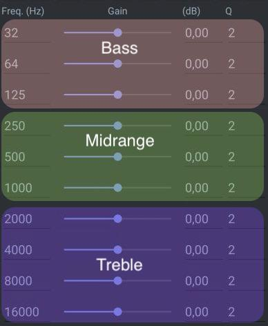

:::note
The AirReps 156X app is required to adjust your EQ. [It can be found here.](https://play.google.com/store/apps/details?id=com.airoha.utapp.sdk)
:::

## Application setup
1. Make sure your pods are already paired/connected to your phone
1. Open the AirReps 156X app, and click "Select Device," select your paired headset, then click the large "CONNECT" button.
1. After successfully connecting, click the "EQUALIZER" button.

## Equaliser Screen
On the equaliser screen, you must do the following before changing any values. If you do not do this, your settings will not be saved.

1. Set your "EQ Index" to 1
1. Click "GET CURRENT EQ INDEX"
    * 
1. Click "SET INDEX" button
1. Make sure **10** is selected under "EQ Values"
    * 
1. The sliders represent a range of frequencies, which represent the audible spectrum that the human ear can hear (31Hz - 19kHz). You can see what these numbers translate to in the following screen:
    * **Freq (Hz):** the part of the audible spectrum you are modifying
    * **Gain:** Increase or decrease the volume of that frequency
    * **(dB):** The numerical value of the slider: -12dB to +12dB
    * **Q:** Represents the speaker's Q value. Generally speaking, the lower the value the better the speaker. **For our purposes, don't modify this value.**
    * 
1. Common exmaples in each range:
    * **10-50Hz:** Low Frequency Effects (LFE). Barely audible and used by "bass shaker" devices.
    * **50-100Hz:** Musical bass - bass guitar, kick drums, orchestral bass, etc.
    * **100-200Hz:** Upper musical bass - lowest male volacs, "directional bass"
    * **200-4000Hz:** Midrange - Dialog, general instruments
    * **4000-20000Hz:** Treble - Cymbals, triangles, bells, etc (also sibilance - the "sssss" sound)
1. When you're done setting your EQ, click the "SAVE DATA" button

## Community Equaliser Settings
Adjust your EQ Sliders (gain) until the (dB) values reads the same values.
* "-" equals a decrease in dB
* "0" equals no change
* "+" equals an increase in dB

### All-Rounder
Ideal for most genres, including:
* Pop
* R&B
* Rock
* Classical
* Alternative

| Frequency | (dB) Value | 
|------------|--------------|
| 32Hz | + 8 |
| 64Hz | + 8 |
| 125Hz | + 4 |
| 250Hz | + 1 |
| 500Hz | - 2 |
| 1000Hz | + 3 |
| 2000Hz | + 6 |
| 4000Hz | + 5 |
| 8000Hz | + 6 |
| 16000Hz | + 5 |

### Hip-Hop | Bass Booster
Ideal for Hip-Hop, or if you want a big bass boost. 

| Frequency | (dB) Value | 
|------------|--------------|
| 32Hz | + 8 |
| 64Hz | + 8 |
| 125Hz | + 4 |
| 250Hz | + 6 |
| 500Hz | - 1 |
| 1000Hz | - 1 |
| 2000Hz | + 4 |
| 4000Hz | - 1 |
| 8000Hz | + 4 |
| 16000Hz | + 6 |

### Electronic | Dance
Ideal for "Electronic" music.

| Frequency | (dB) Value | 
|------------|--------------|
| 32Hz | + 8 |
| 64Hz | + 6 |
| 125Hz | + 2 |
| 250Hz | + 1 |
| 500Hz | - 3 |
| 1000Hz | + 4 |
| 2000Hz | + 2 |
| 4000Hz | + 3 |
| 8000Hz | + 6 |
| 16000Hz | + 8 |