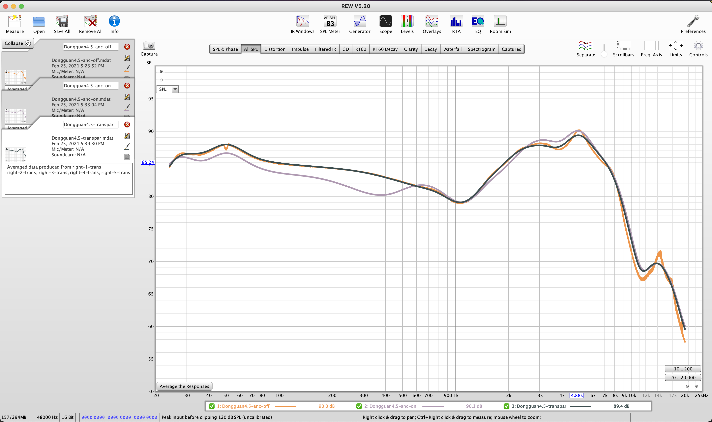

In an effort to clarify the general sound quality of replica airpods, we've started measuring the frequency response of headsets.
What this translates to, is that rather than guessing what "7/10 compared to retails" actually means, you can now visually see the difference between headsets, models, and manufacturers.

## Measuring Equipment
:::info
All AirPods are measured on the same equipment using the same configuration file and process
:::

Each graph is an the averaged result of 5 different measurements (the headset is reseated between measurements), with a 1/2 smoothing applied (1/12 octave smoothing).
- Macbook Pro
- [Roomwizard Equalizer (REW)](https://www.roomeqwizard.com/)
- [Occluded-Ear Simulator - IEC60711 compliant](https://www.aliexpress.com/af/IEC711-.html?d=y&origin=n&SearchText=IEC711+&catId=0&initiative_id=SB_20210225130832)

### Baseline settings
- SPL calibration target: -31.1 dB
- Sampling rate: 48 kHz
- Sweep level: -20 dBFS
- Maximum SPL: 112 dB
- SPL reading calibration: 84 dB

### Measurement settings
- Lowest frequency: 20 Hz
- Highest frequency: 20,000 Hz
- Level: -20.0 dBFS

## References
- [Congifuration for REW](https://www.headphonesty.com/2020/05/how-to-measure-headphones-minidsp-ears/)
- [Configuration for iOS](https://www.headphonesty.com/2020/10/how-to-measure-iems/)